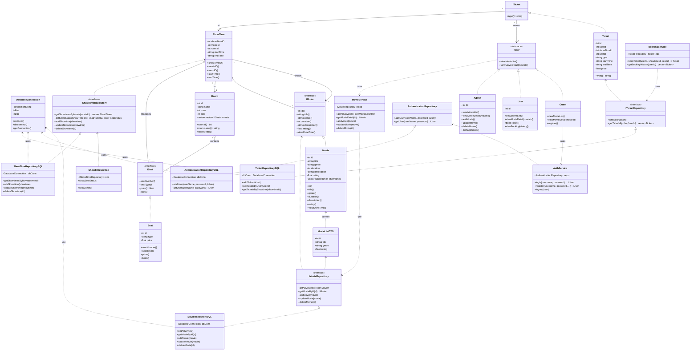

```mermaid
classDiagram

    %% Database
    class DatabaseConnection {
        -connectionString
        -hEnv
        -hDbc
        +connect()
        +disconnect()
        +getConnection()
    }

    %% Movie Entity & Interface
    class IMovie {
        <<interface>>
        +int id()
        +string title()
        +string genre()
        +int duration()
        +string description()
        +float rating()
        +viewShowTime()
    }

    class Movie {
        -int id
        -string title
        -string genre
        -int duration
        -string description
        -float rating
        -vector~ShowTime~ showTimes
        +id()
        +title()
        +genre()
        +duration()
        +description()
        +rating()
        +viewShowTime()
    }

    %% DTOs
    class MovieListDTO {
        +int id
        +string title
        +string genre
        +float rating
    }

    %% Repository
    class IMovieRepository {
        <<interface>>
        +getAllMovies() list~IMovie~
        +getMovieById(id) IMovie
        +addMovie(movie)
        +updateMovie(movie)
        +deleteMovie(id)
    }

    class MovieRepositorySQL {
        - DatabaseConnection: dbConn
        +getAllMovies()
        +getMovieById(id)
        +addMovie(movie)
        +updateMovie(movie)
        +deleteMovie(id)
    }

    %% Service
    class MovieService {
        -IMovieRepository : repo  
        +getAllMovies() list~MovieListDTO~
        +getMovieDetail(id) IMovie
        +addMovie(movie)
        +updateMovie(movie)
        +deleteMovie(id)
    }

    %% Movie Relationships
    IMovie <|.. Movie
    IMovie <.. IMovieRepository
    MovieListDTO <.. IMovieRepository
    IMovieRepository <|.. MovieRepositorySQL
    
    DatabaseConnection <.. MovieRepositorySQL : use
    Movie <.. MovieListDTO : convert
    MovieService ..> IMovieRepository : use

    %% Authentication service

    class IUser {
        <<interface>>
        +viewMovieList()
        +viewMovieDetail(movieId)
    }

    class Guest {
        +viewMovieList()
        +viewMovieDetail(movieId)
        +register()
    }    

    class User {
        -int id
        +viewMovieList()
        +viewMovieDetail(movieId)
        +bookTicket()
        +viewBookingHistory()
    }

    class Admin {
        - int ID
        +viewMovieList()
        +viewMovieDetail(movieId)
        +addMovie()
        +updateMovie()
        +deleteMovie()
        +manageUsers()
    }

    class AuthService {
        - AuthenticationRepository : repo
        +login(username, password) : IUser
        +register(username, password, ...) IUser
        +logout(user)
    }

    class AuthenticationRepository {
        +addUser(userName, password, IUser)*
        +getUser(userName, password)* IUser
    }

    class AuthenticationRepositorySQL {
        - DatabaseConnection: dbConn
        +addUser(userName, password, IUser)
        +getUser(userName, password) IUser
    }

    %%account Relationships
    IUser <|.. Guest
    IUser <|.. User
    IUser <|.. Admin
    IUser ..> MovieService : uses
    Guest ..> AuthService : uses
    AuthenticationRepository <.. AuthService
    AuthenticationRepository <|.. AuthenticationRepositorySQL
    DatabaseConnection <.. AuthenticationRepositorySQL : uses

    %% Room & Showtime
    class Room {
        -int id
        -string name
        -int rows
        -int cols
        -vector~vector~*ISeat~~ seats
        +roomId() int
        +roomName() string
        +showSeats()
    }

    class ISeat {
        <<interface>>
        +seatNumber()*
        +seatType()*
        +price()* float
        +book()*
    }

    class Seat {
        -int id
        -string type
        -float price
        +seatNumber()
        +seatType()
        +price()
        +book()
    }

    class ShowTimeService {
        - IShowTimeRepository : repo
        +showTime() 
        +showSeatStatus
    }

    class ShowTime {
        -int showTimeID
        -int movieId
        -int roomId
        -string startTime
        -string endTime
        +showTimeID()
        +movieID()
        +roomID()
        +startTime()
        +endTime()
    }

    class IShowTimeRepository {
        <<interface>>
        +getShowtimesByMovie(movieId) vector~ShowTime~
        +getSeatsStatus(showTimeID) -map~seatID, bool~ seatStatus
        +addShowtime(showtime)
        +updateShowtime(showtime)
        +deleteShowtime(id)
    }

    class ShowTimeRepositorySQL {
        -DatabaseConnection : dbConn
        +getShowtimesByMovie(movieId)
        +addShowtime(showtime)
        +updateShowtime(showtime)
        +deleteShowtime(id)
    }

    ISeat <|.. Seat
    Room "1" o-- "*" ISeat : contains
    ShowTime "1" --> "1" IMovie : shows
    ShowTime "*" <-- "1" IMovie
    ShowTime "1" --> "1" Room : in
    ShowTime "*" o-- "*" ISeat : manages

    ShowTime <.. IShowTimeRepository
    IShowTimeRepository <.. ShowTimeService
    IShowTimeRepository <|.. ShowTimeRepositorySQL
    DatabaseConnection <.. ShowTimeRepositorySQL : uses


    %% Ticket and Booking

    class ITicket {
        +type()* string
    }

    class Ticket {
        -int id
        -int userId
        -int showTimeId
        -int seatId
        -string type
        -string startTime
        -string endTime
        -float price
        +type() string
    }

    class ITicketRepository {
        <<interface>>
        +addTicket(ticket)*
        +getTicketsByUser(userId)* vector~Ticket~
    }

    class TicketRepositorySQL {
        -dbConn : DatabaseConnection
        +addTicket(ticket)
        +getTicketsByUser(userId)
        +getTicketsByShowtime(showtimeId)
    }

    class BookingService {
        -ITicketRepository : ticketRepo
        +bookTicket(userId, showtimeId, seatId) : Ticket
        +getBookingHistory(userId) vector~Ticket~
    }

    %% Relationships
    ITicket <|.. Ticket
    Ticket <.. ITicketRepository
    ITicketRepository <|.. TicketRepositorySQL
    DatabaseConnection <.. TicketRepositorySQL : uses
    BookingService ..> ITicketRepository : uses
    ITicket "*" --> "1" IUser : owner
    ITicket "*" --> "1" ShowTime : at

```