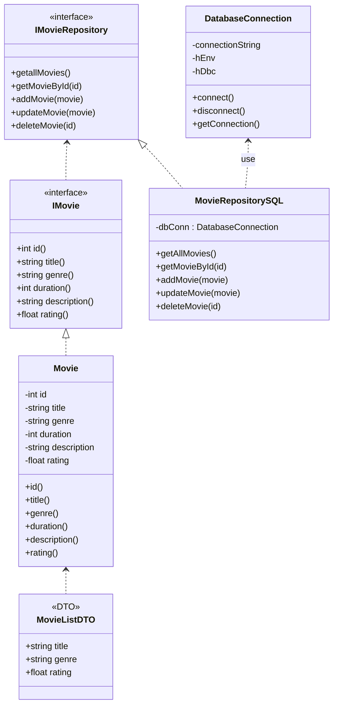

```mermaid
classDiagram
    class DatabaseConnection {
        +connect()
        +disconnect()
        +getConnection()
        -connectionString
        -hEnv
        -hDbc
    }

    class IMovie {
        <<interface>>
        +int id()
        +string title()
        +string genre()
        +int duration()
        +string description()
        +float rating()
    }

    class Movie {
        -int id
        -string title
        -string genre
        -int duration
        -string description
        -float rating
        +id()
        +title()
        +genre()
        +duration()
        +description()
        +rating()
    }

    class IMovieRepository {
        <<interface>>
        +getallMovies()
        +getMovieById(id)
        +addMovie(movie)
        +updateMovie(movie)
        +deleteMovie(id)
    }

    class MovieRepositorySQL {
        -dbConn : DatabaseConnection
        +getAllMovies()
        +getMovieById(id)
        +addMovie(movie)
        +updateMovie(movie)
        +deleteMovie(id)
    }

    class MovieListDTO {
        <<DTO>>
        +string title
        +string genre
        +float rating
    }

    IMovie <|.. Movie
    IMovieRepository <|.. MovieRepositorySQL
    Movie <.. MovieListDTO
    DatabaseConnection <.. MovieRepositorySQL : use
    IMovieRepository <.. IMovie

```