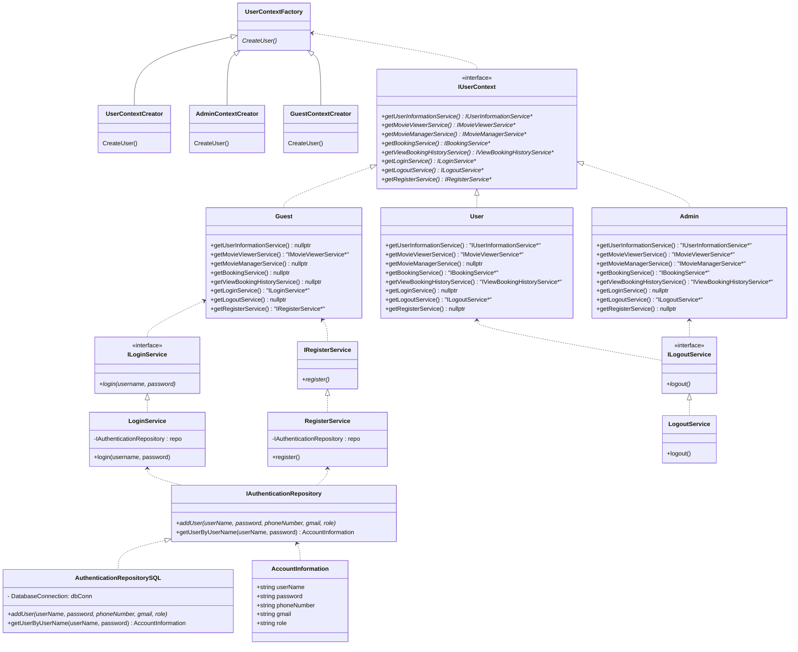

```mermaid


classDiagram
direction TB
    class AccountInformation {
	    +string userName
	    +string password
	    +string phoneNumber
	    +string gmail
	    +string role
    }

    class User {
	    +getUserInformationService() "IUserInformationService*"
	    +getMovieViewerService() "IMovieViewerService*"
	    +getMovieManagerService() nullptr
	    +getBookingService() "IBookingService*"
	    +getViewBookingHistoryService() "IViewBookingHistoryService*"
	    +getLoginService() nullptr
	    +getLogoutService() "ILogoutService*"
	    +getRegisterService() nullptr
    }

    class Admin {
	    +getUserInformationService() "IUserInformationService*"
	    +getMovieViewerService() "IMovieViewerService*"
	    +getMovieManagerService() "IMovieManagerService*"
	    +getBookingService() "IBookingService*"
	    +getViewBookingHistoryService() "IViewBookingHistoryService*"
	    +getLoginService() nullptr
	    +getLogoutService() "ILogoutService*"
	    +getRegisterService() nullptr
    }

    class UserContextFactory {
        CreateUser()*
    }

    class UserContextCreator {
        CreateUser()
    }

    class AdminContextCreator {
        CreateUser()
    }
    
    class GuestContextCreator {
        CreateUser()
    }

    class ILoginService {
	    +login(username, password)*

    }

    class LoginService {
	    -IAuthenticationRepository : repo
	    +login(username, password)
    }

    class ILogoutService {
	    +logout()*
    }

    class LogoutService {
	    +logout()
    }

    class IRegisterService {
	    +register()*
    }

    class RegisterService {
        -IAuthenticationRepository : repo
	    +register()
    }


    class IAuthenticationRepository {
	    +addUser(userName, password, phoneNumber, gmail, role)*
	    +getUserByUserName(userName, password) AccountInformation
    }

    class AuthenticationRepositorySQL {
	    - DatabaseConnection: dbConn
	    +addUser(userName, password, phoneNumber, gmail, role)*
	    +getUserByUserName(userName, password) AccountInformation
    }

    class IUserContext {
	    +getUserInformationService() IUserInformationService**
	    +getMovieViewerService() IMovieViewerService**
	    +getMovieManagerService() IMovieManagerService**
	    +getBookingService() IBookingService**
	    +getViewBookingHistoryService() IViewBookingHistoryService**
	    +getLoginService() ILoginService**
	    +getLogoutService() ILogoutService**
	    +getRegisterService() IRegisterService**
    }

    class Guest {
	    +getUserInformationService() nullptr
	    +getMovieViewerService() "IMovieViewerService*"
	    +getMovieManagerService() nullptr
	    +getBookingService() nullptr
	    +getViewBookingHistoryService() nullptr
	    +getLoginService() "ILoginService*"
	    +getLogoutService() nullptr
	    +getRegisterService() "IRegisterService*"
    }

	<<interface>> ILoginService
	<<interface>> ILogoutService
	<<interface>> IUserContext

    UserContextFactory <|-- UserContextCreator
    UserContextFactory <|-- AdminContextCreator
    UserContextFactory <|-- GuestContextCreator
    UserContextFactory <.. IUserContext
    IUserContext <|.. Guest
    IUserContext <|.. User
    IUserContext <|.. Admin
    IAuthenticationRepository <|.. AuthenticationRepositorySQL
    IAuthenticationRepository <.. AccountInformation
    ILoginService <|.. LoginService
    LoginService <.. IAuthenticationRepository
    RegisterService <.. IAuthenticationRepository
    ILogoutService <|.. LogoutService
    IRegisterService <|.. RegisterService 
    Guest <.. ILoginService
    Guest <.. IRegisterService
    User <.. ILogoutService
    Admin <.. ILogoutService
```