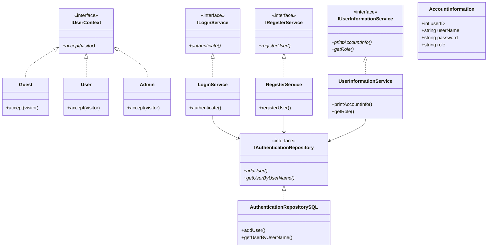

```mermaid
classDiagram
direction TB

    %% User Context
    class IUserContext {
        <<interface>>
        +accept(visitor)*
    }

    class Guest {
        +accept(visitor)
    }

    class User {
        +accept(visitor)
    }

    class Admin {
        +accept(visitor)
    }

    %% Services
    class ILoginService {
        <<interface>>
        +authenticate()*
    }

    class LoginService {
        +authenticate()
    }

    class IRegisterService {
        <<interface>>
        +registerUser()*
    }

    class RegisterService {
        +registerUser()
    }

    class IUserInformationService {
        <<interface>>
        +printAccountInfo()*
        +getRole()*
    }

    class UserInformationService {
        +printAccountInfo()
        +getRole()
    }

    %% Repository
    class IAuthenticationRepository {
        <<interface>>
        +addUser()*
        +getUserByUserName()*
    }

    class AuthenticationRepositorySQL {
        +addUser()
        +getUserByUserName()
    }

    %% Core Data
    class AccountInformation {
        +int userID
        +string userName
        +string password
        +string role
    }

    %% Relationships
    IUserContext <|.. Guest
    IUserContext <|.. User
    IUserContext <|.. Admin
    ILoginService <|.. LoginService
    IRegisterService <|.. RegisterService
    IUserInformationService <|.. UserInformationService
    IAuthenticationRepository <|.. AuthenticationRepositorySQL
    LoginService --> IAuthenticationRepository
    RegisterService --> IAuthenticationRepository
    UserInformationService --> IAuthenticationRepository
```