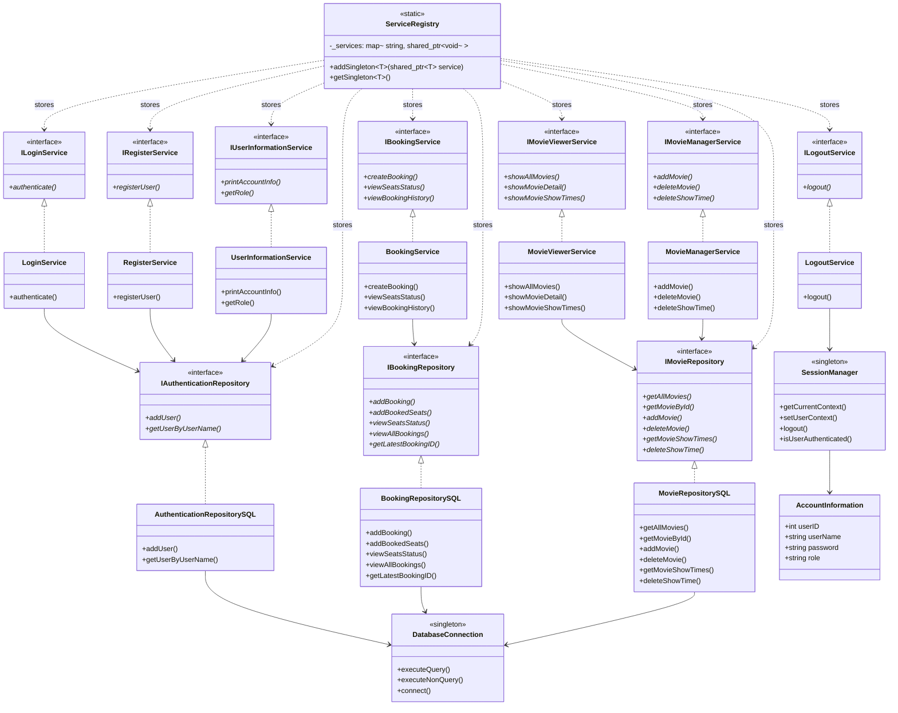

```mermaid
classDiagram
direction TB

    %% Core Singletons
    class ServiceRegistry {
        <<static>>
        +addSingleton~T~(shared_ptr~T~ service)
        +getSingleton~T~()
        -_services: map~ string, shared_ptr~void~ ~
    }

    class SessionManager {
        <<singleton>>
        +getCurrentContext()
        +setUserContext()
        +logout()
        +isUserAuthenticated()
    }

    class DatabaseConnection {
        <<singleton>>
        +executeQuery()
        +executeNonQuery()
        +connect()
    }

    %% Service Interfaces
    class ILoginService {
        <<interface>>
        +authenticate()*
    }

    class IRegisterService {
        <<interface>>
        +registerUser()*
    }

    class IBookingService {
        <<interface>>
        +createBooking()*
        +viewSeatsStatus()*
        +viewBookingHistory()*
    }

    class IMovieViewerService {
        <<interface>>
        +showAllMovies()*
        +showMovieDetail()*
        +showMovieShowTimes()*
    }

    class IMovieManagerService {
        <<interface>>
        +addMovie()*
        +deleteMovie()*
        +deleteShowTime()*
    }

    class IUserInformationService {
        <<interface>>
        +printAccountInfo()*
        +getRole()*
    }

    class ILogoutService {
        <<interface>>
        +logout()*
    }

    %% Service Implementations
    class LoginService {
        +authenticate()
    }

    class RegisterService {
        +registerUser()
    }

    class BookingService {
        +createBooking()
        +viewSeatsStatus()
        +viewBookingHistory()
    }

    class MovieViewerService {
        +showAllMovies()
        +showMovieDetail()
        +showMovieShowTimes()
    }

    class MovieManagerService {
        +addMovie()
        +deleteMovie()
        +deleteShowTime()
    }

    class UserInformationService {
        +printAccountInfo()
        +getRole()
    }

    class LogoutService {
        +logout()
    }

    %% Repository Interfaces
    class IAuthenticationRepository {
        <<interface>>
        +addUser()*
        +getUserByUserName()*
    }

    class IBookingRepository {
        <<interface>>
        +addBooking()*
        +addBookedSeats()*
        +viewSeatsStatus()*
        +viewAllBookings()*
        +getLatestBookingID()*
    }

    class IMovieRepository {
        <<interface>>
        +getAllMovies()*
        +getMovieById()*
        +addMovie()*
        +deleteMovie()*
        +getMovieShowTimes()*
        +deleteShowTime()*
    }

    %% Repository Implementations
    class AuthenticationRepositorySQL {
        +addUser()
        +getUserByUserName()
    }

    class BookingRepositorySQL {
        +addBooking()
        +addBookedSeats()
        +viewSeatsStatus()
        +viewAllBookings()
        +getLatestBookingID()
    }

    class MovieRepositorySQL {
        +getAllMovies()
        +getMovieById()
        +addMovie()
        +deleteMovie()
        +getMovieShowTimes()
        +deleteShowTime()
    }

    %% Core Data
    class AccountInformation {
        +int userID
        +string userName
        +string password
        +string role
    }

    %% Service Interface Implementations
    ILoginService <|.. LoginService
    IRegisterService <|.. RegisterService
    IBookingService <|.. BookingService
    IMovieViewerService <|.. MovieViewerService
    IMovieManagerService <|.. MovieManagerService
    IUserInformationService <|.. UserInformationService
    ILogoutService <|.. LogoutService

    %% Repository Interface Implementations
    IAuthenticationRepository <|.. AuthenticationRepositorySQL
    IBookingRepository <|.. BookingRepositorySQL
    IMovieRepository <|.. MovieRepositorySQL

    %% Service Dependencies
    LoginService --> IAuthenticationRepository
    RegisterService --> IAuthenticationRepository
    UserInformationService --> IAuthenticationRepository
    BookingService --> IBookingRepository
    MovieViewerService --> IMovieRepository
    MovieManagerService --> IMovieRepository
    LogoutService --> SessionManager

    %% Repository Dependencies
    AuthenticationRepositorySQL --> DatabaseConnection
    BookingRepositorySQL --> DatabaseConnection
    MovieRepositorySQL --> DatabaseConnection

    %% ServiceRegistry stores all services
    ServiceRegistry ..> ILoginService : stores
    ServiceRegistry ..> IRegisterService : stores
    ServiceRegistry ..> IBookingService : stores
    ServiceRegistry ..> IMovieViewerService : stores
    ServiceRegistry ..> IMovieManagerService : stores
    ServiceRegistry ..> IUserInformationService : stores
    ServiceRegistry ..> ILogoutService : stores
    ServiceRegistry ..> IAuthenticationRepository : stores
    ServiceRegistry ..> IBookingRepository : stores
    ServiceRegistry ..> IMovieRepository : stores

    SessionManager --> AccountInformation
```