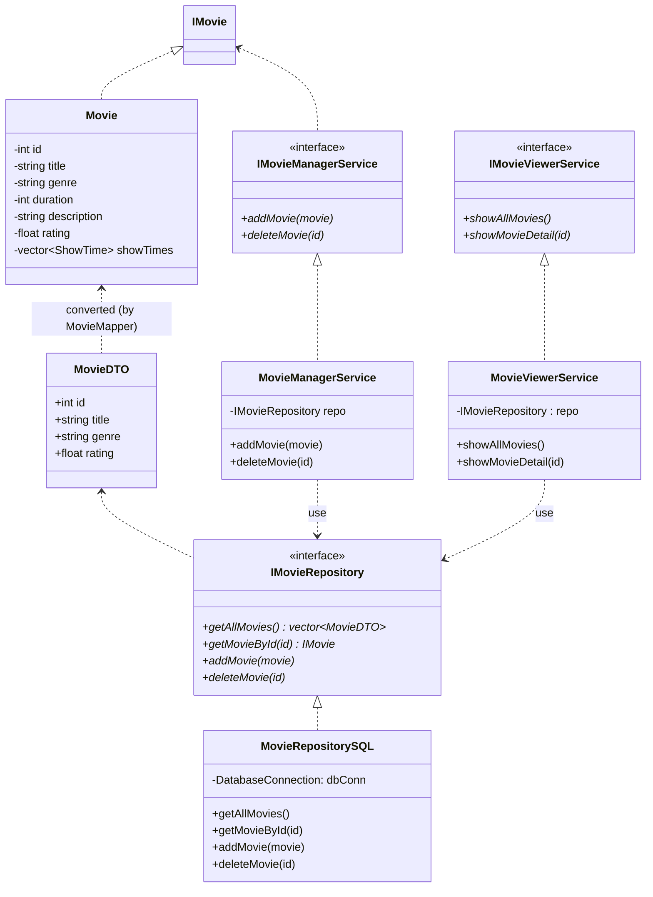

```mermaid
classDiagram
direction TB
    class IMovie {
    }

    class Movie {
	    -int id
	    -string title
	    -string genre
	    -int duration
	    -string description
	    -float rating
	    -vector~ShowTime~ showTimes
    }

    class MovieDTO {
	    +int id
	    +string title
	    +string genre
	    +float rating
    }

    class IMovieRepository {
	    +getAllMovies()* vector~MovieDTO~
	    +getMovieById(id)* IMovie
	    +addMovie(movie)*
	    +deleteMovie(id)*
    }

    class MovieRepositorySQL {
	    -DatabaseConnection: dbConn
	    +getAllMovies()
	    +getMovieById(id)
	    +addMovie(movie)
	    +deleteMovie(id)
    }

    class IMovieViewerService {
	    +showAllMovies()*
	    +showMovieDetail(id)*
    }

    class IMovieManagerService {
	    +addMovie(movie)*
	    +deleteMovie(id)*
    }

    class MovieManagerService {
	    -IMovieRepository repo
	    +addMovie(movie)
	    +deleteMovie(id)
    }

    class MovieViewerService {
	    -IMovieRepository : repo
	    +showAllMovies()
	    +showMovieDetail(id)
    }

    %% class DatabaseConnection {
	%%     -connectionString
	%%     -hEnv
	%%     -hDbc
	%%     +connect()
	%%     +disconnect()
	%%     +getConnection()
    %% }

	<<interface>> IMovieManagerService
	<<interface>> IMovieViewerService
    <<interface>> IMovieRepository

    IMovie <|.. Movie
    IMovie <.. IMovieManagerService
    MovieDTO <.. IMovieRepository
    IMovieRepository <|.. MovieRepositorySQL
    %% DatabaseConnection <.. MovieRepositorySQL : use
    Movie <.. MovieDTO : converted (by MovieMapper)
    MovieManagerService ..> IMovieRepository : use
    MovieViewerService ..> IMovieRepository : use
    IMovieManagerService <|.. MovieManagerService
    IMovieViewerService <|.. MovieViewerService

```