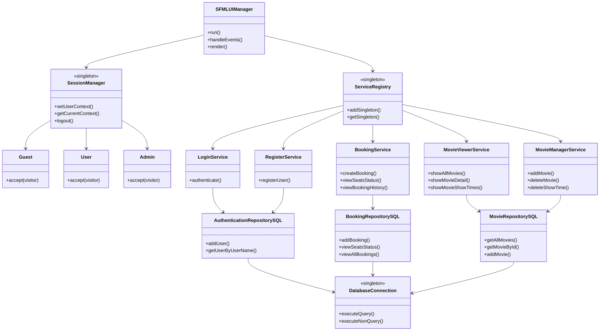

```mermaid
classDiagram
direction TB

    %% UI Layer
    class SFMLUIManager {
        +run()
        +handleEvents()
        +render()
    }

    %% Core System
    class SessionManager {
        <<singleton>>
        +setUserContext()
        +getCurrentContext()
        +logout()
    }

    class ServiceRegistry {
        <<singleton>>
        +addSingleton()
        +getSingleton()
    }

    %% User Contexts
    class Guest {
        +accept(visitor)
    }

    class User {
        +accept(visitor)
    }

    class Admin {
        +accept(visitor)
    }

    %% Services
    class LoginService {
        +authenticate()
    }

    class RegisterService {
        +registerUser()
    }

    class BookingService {
        +createBooking()
        +viewSeatsStatus()
        +viewBookingHistory()
    }

    class MovieViewerService {
        +showAllMovies()
        +showMovieDetail()
        +showMovieShowTimes()
    }

    class MovieManagerService {
        +addMovie()
        +deleteMovie()
        +deleteShowTime()
    }

    %% Repository
    class AuthenticationRepositorySQL {
        +addUser()
        +getUserByUserName()
    }

    class BookingRepositorySQL {
        +addBooking()
        +viewSeatsStatus()
        +viewAllBookings()
    }

    class MovieRepositorySQL {
        +getAllMovies()
        +getMovieById()
        +addMovie()
    }

    %% Database
    class DatabaseConnection {
        <<singleton>>
        +executeQuery()
        +executeNonQuery()
    }

    %% Key Relationships
    SFMLUIManager --> SessionManager
    SFMLUIManager --> ServiceRegistry
    SessionManager --> Guest
    SessionManager --> User
    SessionManager --> Admin
    ServiceRegistry --> LoginService
    ServiceRegistry --> RegisterService
    ServiceRegistry --> BookingService
    ServiceRegistry --> MovieViewerService
    ServiceRegistry --> MovieManagerService
    LoginService --> AuthenticationRepositorySQL
    RegisterService --> AuthenticationRepositorySQL
    BookingService --> BookingRepositorySQL
    MovieViewerService --> MovieRepositorySQL
    MovieManagerService --> MovieRepositorySQL
    AuthenticationRepositorySQL --> DatabaseConnection
    BookingRepositorySQL --> DatabaseConnection
    MovieRepositorySQL --> DatabaseConnection
```