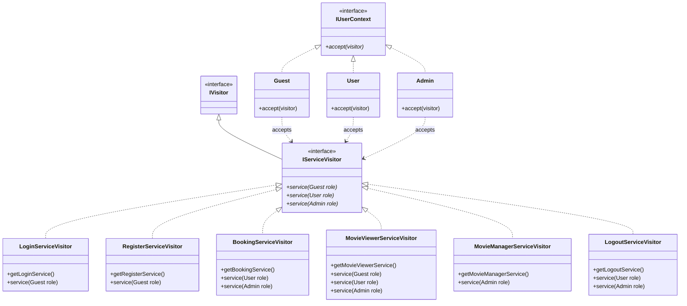

```mermaid
classDiagram
direction TB

    %% Base Interfaces
    class IVisitor {
        <<interface>>
    }

    class IServiceVisitor {
        <<interface>>
        +service(Guest role)*
        +service(User role)*
        +service(Admin role)*
    }

    %% Service Visitors
    class LoginServiceVisitor {
        +getLoginService()
        +service(Guest role)
    }

    class RegisterServiceVisitor {
        +getRegisterService()
        +service(Guest role)
    }

    class BookingServiceVisitor {
        +getBookingService()
        +service(User role)
        +service(Admin role)
    }

    class MovieViewerServiceVisitor {
        +getMovieViewerService()
        +service(Guest role)
        +service(User role)
        +service(Admin role)
    }

    class MovieManagerServiceVisitor {
        +getMovieManagerService()
        +service(Admin role)
    }

    class LogoutServiceVisitor {
        +getLogoutService()
        +service(User role)
        +service(Admin role)
    }

    %% User Contexts
    class IUserContext {
        <<interface>>
        +accept(visitor)*
    }

    class Guest {
        +accept(visitor)
    }

    class User {
        +accept(visitor)
    }

    class Admin {
        +accept(visitor)
    }

    %% Relationships
    IVisitor <|-- IServiceVisitor
    IServiceVisitor <|.. LoginServiceVisitor
    IServiceVisitor <|.. RegisterServiceVisitor
    IServiceVisitor <|.. BookingServiceVisitor
    IServiceVisitor <|.. MovieViewerServiceVisitor
    IServiceVisitor <|.. MovieManagerServiceVisitor
    IServiceVisitor <|.. LogoutServiceVisitor

    IUserContext <|.. Guest
    IUserContext <|.. User
    IUserContext <|.. Admin

    Guest ..> IServiceVisitor : accepts
    User ..> IServiceVisitor : accepts
    Admin ..> IServiceVisitor : accepts
```