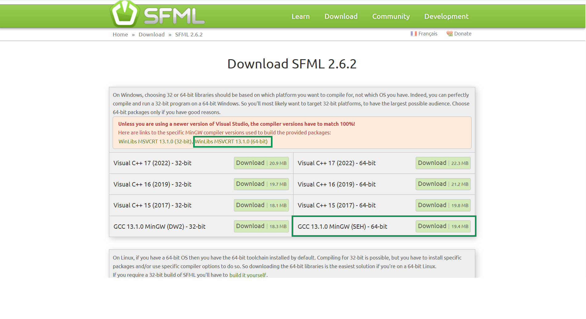

# 🎮 Hướng dẫn cài đặt SFML 2.6.2 với MinGW GCC 13.1.0 trên Windows

> Hướng dẫn chi tiết cách tải, cài đặt và chạy thử thư viện SFML để lập trình C++ đồ họa, âm thanh, và game development trên Windows.

---

## ✅ Yêu cầu
- Visual Studio Code (VSCode). Hướng dẫn này dành cho IDE VSCode.

---

## 📥 Bước 1: Tải SFML phù hợp

1. Truy cập trang: [https://www.sfml-dev.org/download/sfml/2.6.2/](https://www.sfml-dev.org/download/sfml/2.6.2/)
2. Chọn bản:

```
GCC 13.1.0 MinGW (SEH) - 64-bit
Cài đặt `g++` từ [winlibs GCC 13.1.0]
```


3. Tải về sẽ được file ZIP, ví dụ:

```
SFML-2.6.2-windows-gcc-13.1.0-mingw-64-bit.zip
winlibs-x86_64-posix-seh-gcc-13.1.0-mingw-w64msvcrt-11.0.0-r5.7z
```

---

## 📁 Bước 2: Giải nén thư viện

Giải nén vào thư mục dễ nhớ, ví dụ:

```
C:\Library\SFML-2.6.2\
```
> 📝 Bạn có thể thay `C:/Library` bằng bất kỳ thư mục nào khác nếu muốn. Đây chỉ là gợi ý.

Cấu trúc thư mục sau khi giải nén:

```
C:\Library\SFML-2.6.2\
├── bin\
├── include\
├── lib\
└── ...


C:\Library\winlibs..\mingw64
├── bin\
├── include\
├── lib\
└── ...
```

---

## ⚙️ Bước 3: Thêm `bin` vào biến môi trường PATH (tuỳ chọn)

Để có thể chạy chương trình mà không lỗi thiếu `.dll`, thêm đường dẫn sau vào PATH:

```
C:\Library\winlibs..\mingw64\bin
```

> Đưa đường dẫn này lên đầu để ưu tiên hơn các trình biên dịch khác.
> Copy toàn bộ file `.dll` trong `bin/` của `C:\Library\SFML-2.6.2\` vào cùng thư mục với file `.exe`.

---

## 🔧 Bước 4: Biên dịch thủ công bằng g++

Chạy lệnh sau trong thư mục chứa `main.cpp`:

```bash
g++ -g main.cpp -o main.exe ^
  -IC:/Library/SFML-2.6.2/include ^
  -LC:/Library/SFML-2.6.2/lib ^
  -lsfml-graphics -lsfml-window -lsfml-system
```

---

## 💻 Bước 5: Cấu hình VSCode (nếu sử dụng)

### 📌 File `.vscode/tasks.json` để build:

```json
{
  "version": "2.0.0",
  "tasks": [
    {
      "label": "build SFML app",
      "type": "shell",
      "command": "C:/Library/winlibs-x86_64-posix-seh-gcc-13.1.0-mingw-w64msvcrt-11.0.0-r5/mingw64/bin/g++.exe",// đường dẫn đến file g++.exe của C:\Library\winlibs..\mingw64\bin\g++.exe
      "args": [
        "-g",
        "main.cpp",
        "-o",
        "main.exe",
        "-IC:/Library/SFML-2.6.2-windows-gcc-13.1.0-mingw-64-bit/SFML-2.6.2/include", // đường dẫn đến nơi chứa folder include của SFML
        "-LC:/Library/SFML-2.6.2-windows-gcc-13.1.0-mingw-64-bit/SFML-2.6.2/lib", // đường dẫn đến nơi chứa folder lib của SFML
        "-lsfml-graphics",
        "-lsfml-window",
        "-lsfml-system"
      ],
      "group": {
        "kind": "build",
        "isDefault": true
      },
      "problemMatcher": ["$gcc"]
    }
  ]
}

```

### 🐞 File `.vscode/launch.json` để debug:

```json
{
  "version": "0.2.0",
  "configurations": [
    {
      "name": "C/C++ Runner: Debug Session",
      "type": "cppdbg",
      "request": "launch",
      "args": [],
      "stopAtEntry": false,
      "externalConsole": true,
      "cwd": "c:/Users/Admin/Documents/code/SFML_test", // đường dẫn nơi lưu trữ file .cpp mà bạn biên dịch
      "program": "c:/Users/Admin/Documents/code/SFML_test/build/Debug/outDebug", // tương tự như trên
      "MIMode": "gdb",
      "miDebuggerPath": "gdb",
      "setupCommands": [
        {
          "description": "Enable pretty-printing for gdb",
          "text": "-enable-pretty-printing",
          "ignoreFailures": true
        }
      ]
    }
  ]
}
```

---

## 📄 Mẫu file `main.cpp` cơ bản

```cpp
#include <SFML/Graphics.hpp>

int main() {
    sf::RenderWindow window(sf::VideoMode(800, 600), "SFML Window");
    sf::CircleShape shape(100.f);
    shape.setFillColor(sf::Color::Green);

    while (window.isOpen()) {
        sf::Event event;
        while (window.pollEvent(event)) {
            if (event.type == sf::Event::Closed)
                window.close();
        }

        window.clear();
        window.draw(shape);
        window.display();
    }

    return 0;
}
```

---

## 🧪 Chạy thử

Biên dịch bằng task.json. Nhấn Ctrl + Shift + B
Sau khi biên dịch, chạy chương trình:

```bash
./main.exe
```

Bạn sẽ thấy một cửa sổ hiển thị hình tròn màu xanh lá nếu mọi thứ cài đặt đúng.

---

## 📚 Tài liệu tham khảo

- Trang chủ SFML: https://www.sfml-dev.org
- Tài liệu SFML: https://www.sfml-dev.org/tutorials/2.6/start-linux.php

---
