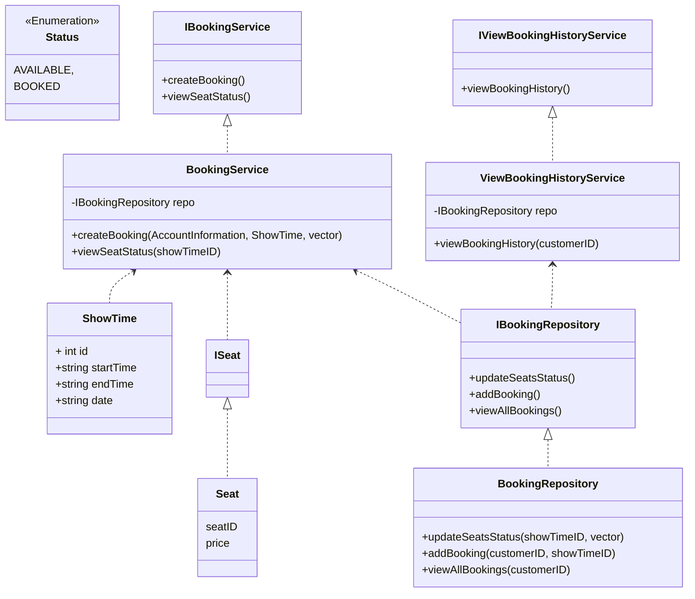

```mermaid
classDiagram
direction TB
    class Status {
	    AVAILABLE,
	    BOOKED
    }

    class ShowTime {
	    + int id
	    +string startTime
	    +string endTime
	    +string date
    }

    class IBookingService {
	    +createBooking()
	    +viewSeatStatus()
    }

    class BookingService {
        -IBookingRepository repo 
	    +createBooking(AccountInformation, ShowTime, vector)
	    +viewSeatStatus(showTimeID)
    }

    class ViewBookingHistoryService {
        -IBookingRepository repo 
	    +viewBookingHistory(customerID)
    }

    class IBookingRepository {
	    +updateSeatsStatus()
	    +addBooking()
	    +viewAllBookings()
    }

    class BookingRepository {
	    +updateSeatsStatus(showTimeID, vector)
	    +addBooking(customerID, showTimeID)
	    +viewAllBookings(customerID)
    }

    class ISeat {
    }

    class Seat {
	    seatID
	    price
    }

    class IViewBookingHistoryService {
	    +viewBookingHistory()
    }

	<<Enumeration>> Status

    ISeat <|.. Seat
    IBookingRepository <|.. BookingRepository
    IBookingService <|.. BookingService
    IViewBookingHistoryService <|.. ViewBookingHistoryService
    BookingService <.. ISeat
    BookingService <.. ShowTime
    BookingService <.. IBookingRepository
    ViewBookingHistoryService <.. IBookingRepository
```