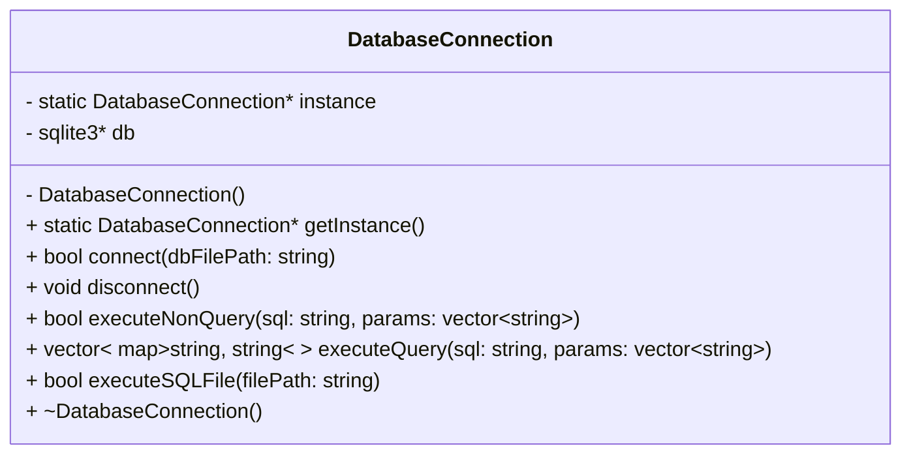

```mermaid
classDiagram
direction TB

class DatabaseConnection {
    - static DatabaseConnection* instance
    - sqlite3* db
    - DatabaseConnection()
    + static DatabaseConnection* getInstance()
    + bool connect(dbFilePath: string)
    + void disconnect()
    + bool executeNonQuery(sql: string, params: vector~string~)
    + vector~ map~string, string~ ~ executeQuery(sql: string, params: vector~string~)
    + bool executeSQLFile(filePath: string)
    + ~DatabaseConnection()
}
```